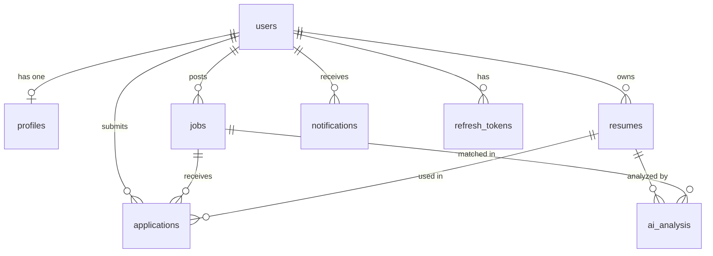

# Database Documentation

## Overview

The AI Job Application Portal uses **PostgreSQL** as its primary database. The schema is designed for deployment on **Neon PostgreSQL** or **Supabase PostgreSQL**.

## Entity Relationship Diagram



## Tables

| Table | Description | Rows (seed) |
|---|---|---|
| `users` | Central user accounts (admins + job seekers) | 7 |
| `profiles` | Extended user profile data (1:1 with users) | 7 |
| `jobs` | Job postings created by admins | 6 |
| `resumes` | User-uploaded resume file references | 5 |
| `applications` | Job applications linking users to jobs via resumes | 6 |
| `ai_analysis` | AI-generated analysis results (resume extract, match score) | 0 |
| `notifications` | In-app user notifications | 6 |
| `refresh_tokens` | JWT refresh token storage for token rotation | 0 |

## Enum Types

| Enum | Values |
|---|---|
| `user_role` | `ADMIN`, `USER` |
| `job_type` | `FULL_TIME`, `PART_TIME`, `CONTRACT`, `REMOTE`, `INTERNSHIP` |
| `job_status` | `DRAFT`, `PUBLISHED`, `CLOSED` |
| `application_status` | `PENDING`, `REVIEWING`, `SHORTLISTED`, `REJECTED`, `HIRED` |
| `analysis_type` | `RESUME_EXTRACT`, `MATCH_SCORE` |

## Relationships & Foreign Keys

| Source Table | Column | References | On Delete |
|---|---|---|---|
| `profiles` | `user_id` | `users(id)` | CASCADE |
| `jobs` | `posted_by` | `users(id)` | CASCADE |
| `resumes` | `user_id` | `users(id)` | CASCADE |
| `applications` | `job_id` | `jobs(id)` | CASCADE |
| `applications` | `user_id` | `users(id)` | CASCADE |
| `applications` | `resume_id` | `resumes(id)` | (default: restrict) |
| `ai_analysis` | `resume_id` | `resumes(id)` | CASCADE |
| `ai_analysis` | `job_id` | `jobs(id)` | SET NULL |
| `notifications` | `user_id` | `users(id)` | CASCADE |
| `refresh_tokens` | `user_id` | `users(id)` | CASCADE |

## Constraints

| Constraint | Type | Description |
|---|---|---|
| `users.email` | UNIQUE | Prevents duplicate email registration |
| `profiles.user_id` | UNIQUE | Enforces one profile per user (1:1) |
| `refresh_tokens.token_hash` | UNIQUE | Prevents token hash collisions |
| `unique_application` | UNIQUE(job_id, user_id) | One application per user per job |

## Indexes

| Index | Table | Column(s) | Purpose |
|---|---|---|---|
| `idx_jobs_status` | jobs | status | Filter by publication status |
| `idx_jobs_posted_by` | jobs | posted_by | Admin's own jobs lookup |
| `idx_jobs_created_at` | jobs | created_at DESC | Newest-first job listing sort |
| `idx_applications_job_id` | applications | job_id | Applicants per job lookup |
| `idx_applications_user_id` | applications | user_id | User's applications lookup |
| `idx_applications_status` | applications | status | Filter by application status |
| `idx_resumes_user_id` | resumes | user_id | User's resumes lookup |
| `idx_ai_analysis_resume_id` | ai_analysis | resume_id | Analysis results per resume |
| `idx_ai_analysis_type` | ai_analysis | analysis_type | Filter by analysis type |
| `idx_notifications_user_id` | notifications | user_id | User's notifications lookup |
| `idx_notifications_is_read` | notifications | is_read | Unread notifications filter |
| `idx_refresh_tokens_user_id` | refresh_tokens | user_id | Token cleanup on logout |

## Triggers

| Trigger | Table | Event | Function |
|---|---|---|---|
| `trg_users_updated_at` | users | BEFORE UPDATE | `update_updated_at_column()` |
| `trg_profiles_updated_at` | profiles | BEFORE UPDATE | `update_updated_at_column()` |
| `trg_jobs_updated_at` | jobs | BEFORE UPDATE | `update_updated_at_column()` |
| `trg_applications_updated_at` | applications | BEFORE UPDATE | `update_updated_at_column()` |

All triggers call `update_updated_at_column()` which sets `NEW.updated_at = NOW()` before each row update.

## Migration Process

### Initial Setup

```bash
# 1. Set DATABASE_URL in backend/.env
# 2. Run the initial migration
psql $DATABASE_URL -f backend/src/db/migrations/001_init.sql

# 3. (Optional) Load seed data for development
psql $DATABASE_URL -f backend/src/db/seed.sql
```

### Adding Future Migrations

1. Create a new numbered file: `migrations/002_description.sql`
2. Wrap changes in a `BEGIN; ... COMMIT;` transaction
3. Use `IF NOT EXISTS` / `IF EXISTS` for idempotency where possible
4. Document the migration purpose in a header comment

### Validation

```bash
# Run the validation script to verify schema integrity
cd backend
npx ts-node-dev src/db/validate-db.ts
```

## File Structure

```
db/
├── schema.sql          # Complete table definitions (reference)
├── indexes.sql         # All performance indexes (reference)
├── seed.sql            # Development seed data
├── validate-db.ts      # Schema validation script
├── migrations/
│   └── 001_init.sql    # Initial migration (executable)
└── README.md           # This file
```
