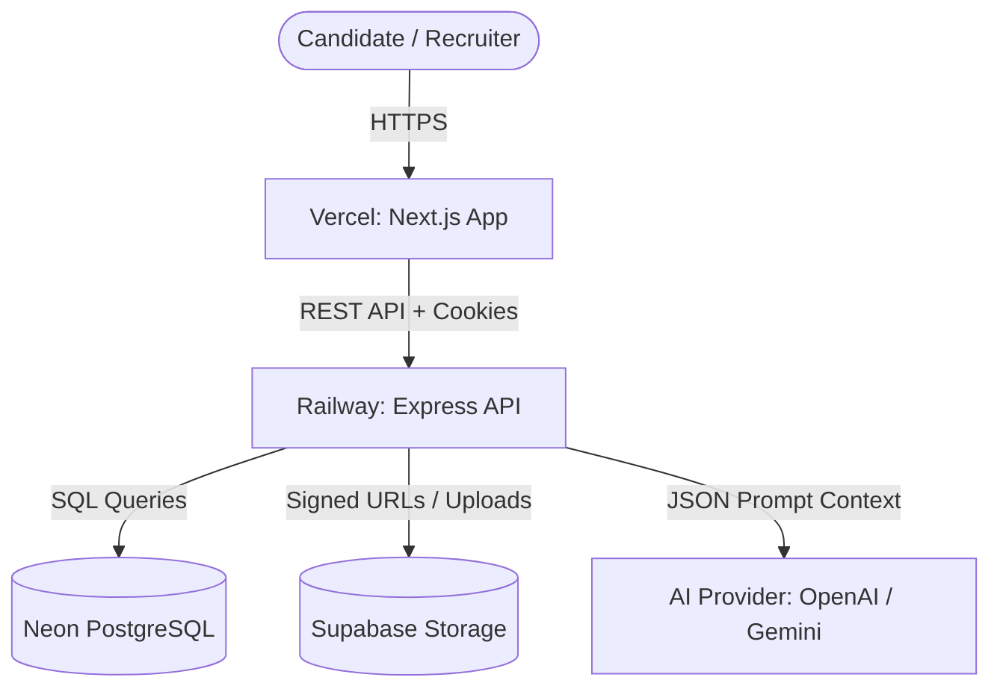
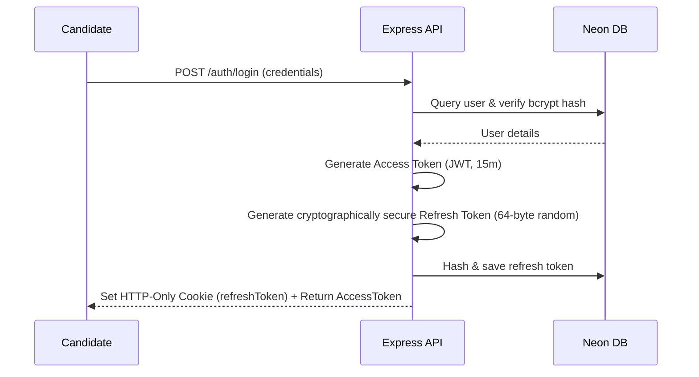
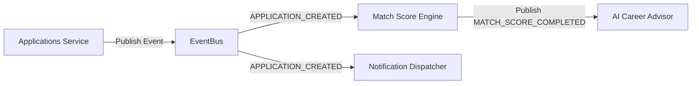
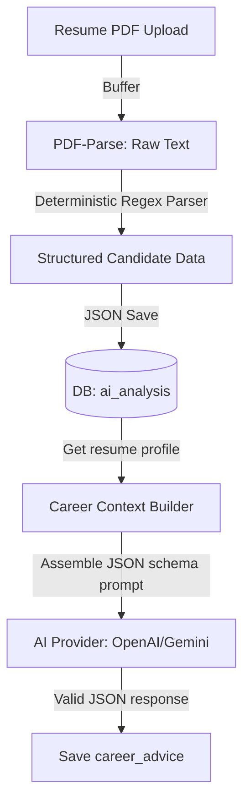

# AI Job Application Portal — System Architecture

This document describes the high-level architecture, design decisions, and data pipelines of the platform.

---

## 1. System Design

The system is split into a decoupled frontend and backend:



### Components
1. **Frontend (Vercel)**: Next.js React application styled with Vanilla CSS and components. Uses Tailwind CSS and React Query for api fetching.
2. **Backend (Railway)**: Express.js server compiling TypeScript, implementing security, validation, rate limiting, and structured logging.
3. **Database (Neon PostgreSQL)**: Serverless relational database holding users, profiles, jobs, applications, notifications, and AI analysis data.
4. **Storage (Supabase)**: Cloud storage bucket hosting candidate PDF resumes, accessed securely via short-lived (15 minutes) signed URLs.
5. **AI Providers**: Decoupled abstraction supporting OpenAI GPT-4o-mini, Google Gemini 1.5 Flash, and a local Mock provider.

---

## 2. Authentication & Authorization Flow

The platform uses a secure session model with JWTs and HTTP-only cookies:



- **Authentication (Who you are)**: Verified using `authenticate` middleware, parsing the JWT from the `Authorization: Bearer <token>` header.
- **Authorization (What you can do)**: Enforced via `requireRole('ADMIN' | 'USER')` middleware, separated from authentication checks.
- **Refresh Token Rotation (RTR)**: Every refresh request invalidates the old token and issues a new pair. If a revoked token is replayed, the session is wiped.

---

## 3. Database Schema Layout

The schema consists of 8 core tables with strict referential integrity and specialized indexes:

```
+---------------+      +----------------+      +---------------+
|     users     |<---->|    profiles    |      | refresh_token |
| (Admin/User)  |      |   (Skill/Edu)  |      |  (Token Hash) |
+---------------+      +----------------+      +---------------+
       |                       |
       |                       v
       |               +----------------+
       |               |    resumes     |
       |               |  (PDF details) |
       |               +----------------+
       v                       |
+---------------+              |
|     jobs      |              |
|  (Draft/Pub)  |              |
+---------------+              |
       |                       v
       |               +----------------+      +---------------------+
       +-------------->|  applications  |<---->| application_timeline|
                       |  (Match Score) |      |   (Hiring History)  |
                       +----------------+      +---------------------+
                               |
                               v
                       +----------------+
                       |  ai_analysis   |
                       |  (Resume Extract|
                       |   Match Details|
                       +----------------+
```

---

## 4. Asynchronous Event Bus

Decoupling is achieved through an in-memory Pub/Sub EventBus:



- **Events**:
  - `APPLICATION_CREATED`: Triggers automated resume-to-job matching analysis and recruiter alert generation in the background.
  - `RESUME_UPLOADED`: Triggers immediate background PDF text extraction and rule-based skill parsing.

---

## 5. AI Pipelines

To ensure compliance with security and privacy policies, raw PDF files and raw resume texts are never sent to external LLM APIs:



---

## 6. Deployment Architecture

- **Frontend (Vercel)**: Next.js static pages with dynamic server actions routing client requests directly to the API domain.
- **Backend (Railway)**: Dockerized container running Node.js 20-alpine. Performs fail-fast environment validation, rate limits traffic, and logs structured traces.
- **Database (Neon)**: Cloud SQL with pooled database connections.
